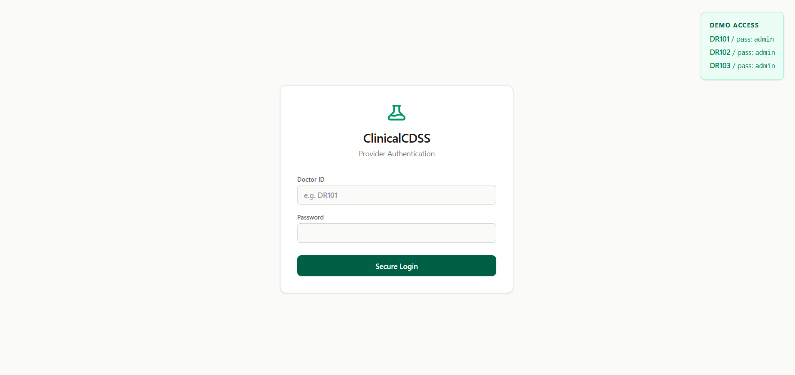
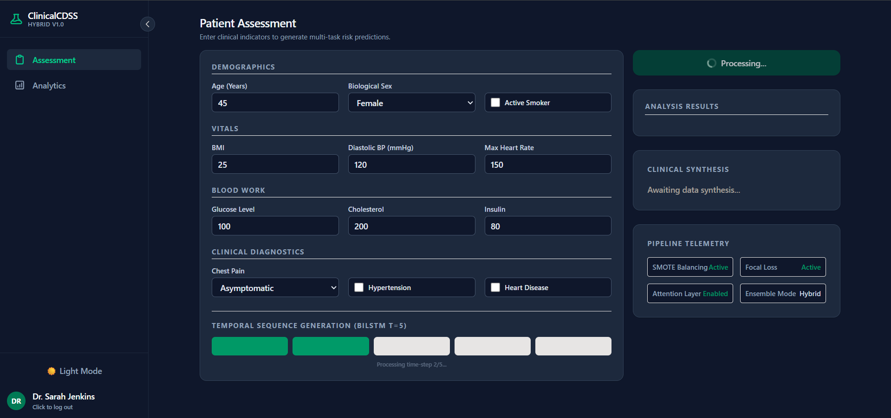
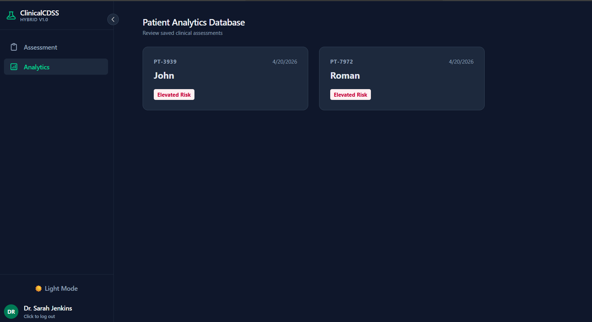
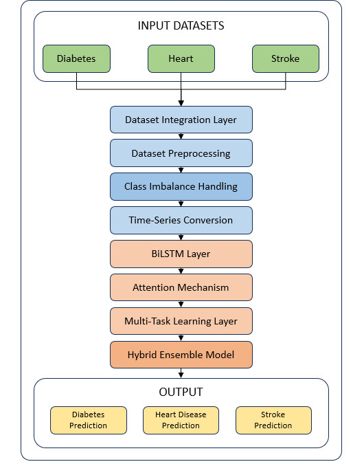
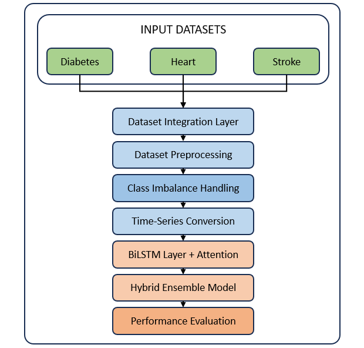

<div align="center">

# 🏥 Multi-Task Clinical Decision Support System (CDSS)

**An enterprise-grade clinical interface powered by a Multi-Task Deep Learning engine.**

[](https://python.org)
[](https://fastapi.tiangolo.com)
[](https://reactjs.org/)
[](https://tailwindcss.com)
[](https://opensource.org/licenses/MIT)

*A Hybrid Ensemble BiLSTM Framework with Temporal Attention for concurrent assessment of Diabetes, Heart Disease, and Stroke.*

[Features](#-core-features) • [Architecture](#-neural-architecture) • [Performance](#-performance-metrics) • [Installation](#-getting-started) • [Tech Stack](#-tech-stack)

</div>

---

## 📸 Interface Showcase

### 🔐 Authentication Layer
<p align="center">
  
</p>
<p align="center"><i>Secure provider login with session-based authentication</i></p>

---

### 📊 Clinical Dashboard
<p align="center">
  
</p>
<p align="center"><i>Real-time disease prediction with interactive controls</i></p>

---

### 🧾 Patient Analytics
<p align="center">
  
</p>
<p align="center"><i>Doctor-specific patient registry with longitudinal insights</i></p>

---

### 🧠 System Architecture
<p align="center">
  
</p>
<p align="center"><i>Hybrid Multi-Task BiLSTM + Ensemble pipeline</i></p>

---

### 🔄 Workflow Pipeline
<p align="center">
  
</p>
<p align="center"><i>End-to-end data processing and prediction flow</i></p>

---

## 🧠 Neural Architecture

The system is built on a **Multi-Task Learning (MTL)** paradigm where shared feature extraction layers seamlessly capture inter-disease dependencies, allowing for more robust and holistic risk predictions.

- ⏱️ **Temporal Intelligence:** Static datasets are intelligently converted into temporal sequences ($T=5$) using a sliding window approach. These are processed through **Bidirectional LSTM (BiLSTM)** layers to capture contextual health progression over time.
- 🎯 **Attention Mechanism:** An integrated custom attention layer assigns differential importance to specific vital signs and temporal steps, dramatically enhancing model interpretability and clinical trust.
- ⚖️ **Imbalance Handling:** Utilizes **SMOTE** (Synthetic Minority Over-sampling Technique) combined with **Focal Loss** to ensure high sensitivity for critical, underrepresented minority cases like Stroke.
- 🤝 **Hybrid Ensemble Engine:** A powerful three-tier ensemble strategy combining **Bagging, Boosting, and Stacking** to minimize both bias and variance, establishing a highly stable predictive baseline.

---

## ✨ Core Features

* **🏥 Concurrent Risk Stratification**: Simultaneously predicts the probability of three major diseases from a unified patient feature space.
* **🔒 Secure Authentication Gateway**: A robust, session-managed login portal with mock provider identities.
* **📊 Clinical Synthesis Engine**: Automatically generates natural language medical summaries based on the highest detected risk factors.
* **🌙 Premium UI/UX**: A responsive, low-contrast clinical dashboard with full Dark Mode support, designed to reduce eye strain during long shifts.

---

## 📊 Performance Metrics

Validation was conducted on an integrated dataset of 6,000+ clinical records. The hybrid architecture demonstrates significant improvements over traditional baselines.

| Metric | Proposed Hybrid Model | Baseline (Random Forest) | Improvement |
| :--- | :---: | :---: | :---: |
| **Accuracy** | **84.5%** | 72.3% | *+12.2%* |
| **Precision** | **88.1%** | 83.0% | *+5.1%* |
| **Recall** | **81.8%** | 80.0% | *+1.8%* |
| **F1-Score** | **84.8%** | 81.0% | *+3.8%* |

---

## 🛠 Tech Stack

### AI & Backend Services
- **Language**: Python 3.12
- **Framework**: FastAPI (Asynchronous REST API)
- **Machine Learning**: TensorFlow 2.x, Keras, Scikit-Learn
- **Data Processing**: Pandas, NumPy, Imbalanced-Learn

### Frontend Client
- **Framework**: React 18 (Hooks, Context API)
- **Styling**: Tailwind CSS v4 (Utility-first, Dark Mode)
- **Build Tool**: Vite (Lightning-fast HMR)
- **Storage**: Persistent LocalStorage Patient Registry

---

## 🚀 Getting Started

### 1. Clone & Backend Setup

```bash
# Clone the repository
git clone <your-repo-link>
cd DiseasePrediction

# Start the FastAPI server (Runs on port 8000)
uvicorn src.main:app --reload
```

### 2. Frontend Setup

Open a new terminal window:

```bash
# Navigate to the frontend directory
cd frontend

# Install dependencies
npm install

# Start the Vite development server
npm run dev
```

### 3. Access the Dashboard

Open `http://localhost:5173` in your browser.

**Demo Credentials:**
- **Doctor ID**: `DR101`
- **Password**: `admin`
*(Full access to Dr. Sarah Jenkins' profile and patient roster)*

---

<div align="center">
  <i>Developed for Advanced Clinical Decision Support Research</i>
</div>
